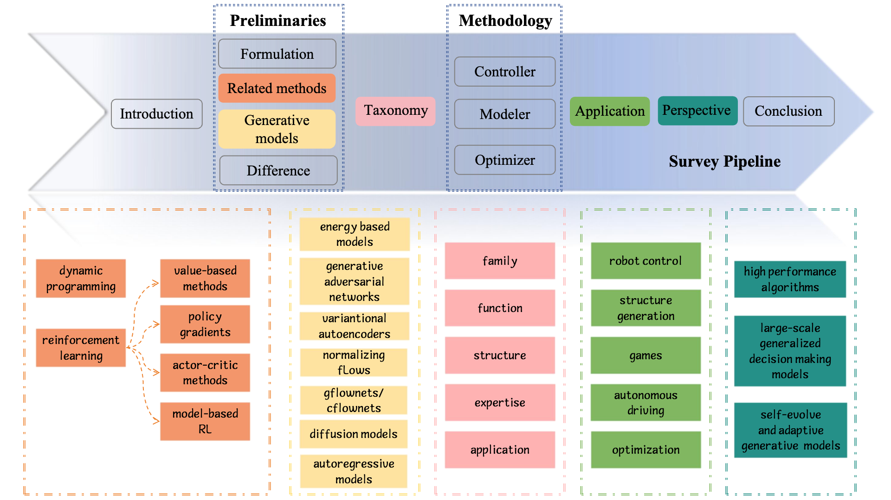
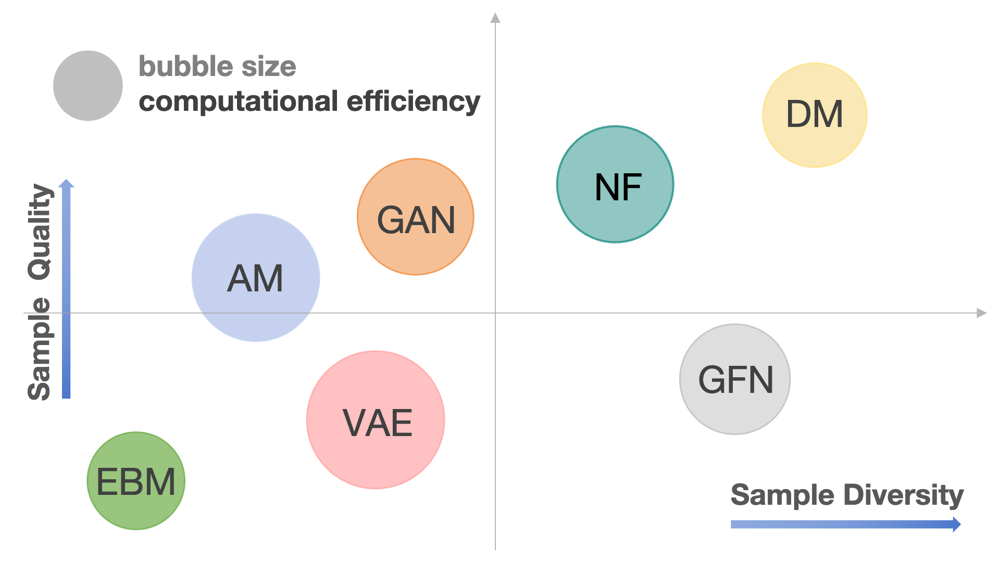
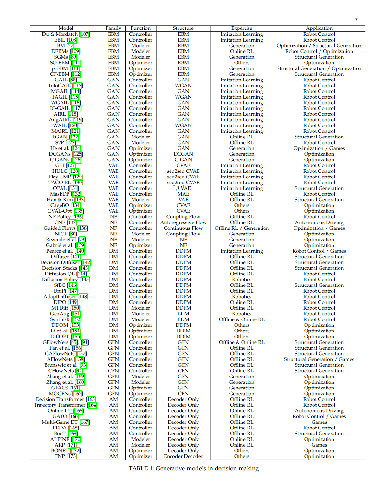
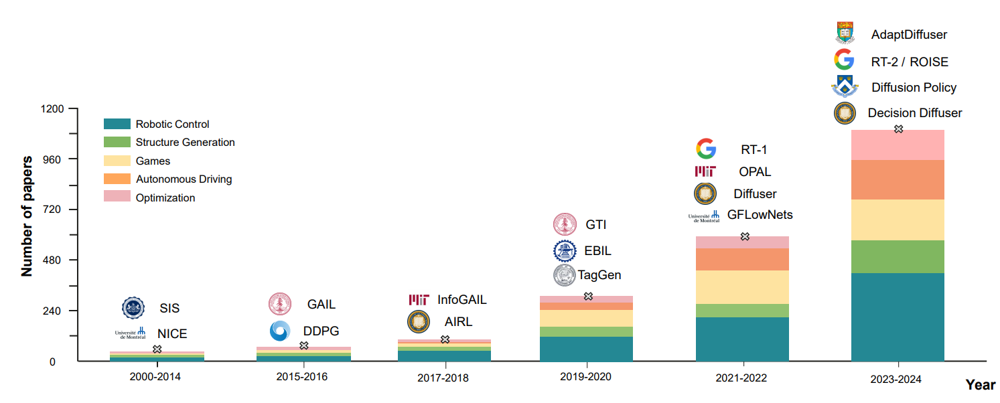

# <p align=center>Awesome Generative Models for Decision Making: <br>A Survey[](https://github.com/xyshao23/Awesome-Generative-Models-for-Decision-Making-Taxonomy) </p>

<p align=center>🔥A curated list of awesome <b>Generative Models</b> for Decision Making🔥</p>

<p align=center>Please feel free to offer your suggestions in the Issues and pull requests to add links.</p>

<p align=center><b>[ Last updated at 2025/03/02 ]</b></p>

<p align=center><a href="https://arxiv.org/abs/2502.17100"><b>Generative Models in Decision Making: A Survey (arxiv)</b></a>

# Table of Contents
## [Overview](#1)
## [Comparison](#2)
## [Table](#table)
## [Taxonomy](#3)
- [Family](#3.1)
- [Function](#3.2)
- [Structure](#3.3)
- [Expertise](#3.4)
- [Applications](#5)
## [Survey: Methodology](#4)
- [Generative Models as Controller](#4.1)
- [Generative Models as Modeler](#4.2)
- [Generative Models as Optimizer](#4.3)
## [Applications](#5)
- [Robot Control](#5.1)
- [Structure Generation](#5.2)
- [Games](#5.3)
- [Autonomous Driving](#5.4)
- [Optimization](#5.5)

<br>
<h2>Overview</h2><p id="1"></p>

<br>
<p style="line-height: 1.6; font-size: 20px;">
    The organization of this survey is as follows:
</p>
<ul style="line-height: 1.6; font-size: 20px;">
    <li><strong>Section 2</strong> introduces <em>sequential decision-making formulation</em> and provides the basics of all examined methods.</li>
    <li>We offer a <strong>detailed introduction</strong> to seven types of generative models and compare their performance with traditional approaches.</li>
    <li><strong>Section 3</strong> presents the proposed taxonomy for categorizing generative decision-making methods.</li>
    <li>In <strong>Section 4</strong>, we review and analyze existing literature according to the introduced taxonomy.</li>
    <li><strong>Section 5</strong> showcases <em>practical applications</em> of generative models in decision-making.</li>
    <li>Finally, <strong>Section 6</strong> discusses <em>future directions</em> of generative models in decision-making.</li>
    <li>We conclude the paper in <strong>Section 7</strong> with an overall summary.</li>
</ul>

<br>
<h2>Comparison</h2><p id="2"></p>

<p>
<ul style="line-height: 1.6; font-size: 20px;">
  <li>Comparison of seven generative models in decision-making: training stability, generation diversity, and computational efficiency.</li>
  <li>Larger bubbles represent higher computational efficiency, with different models indicated by distinct colors. Best viewed in color.</li>
</p>
<br>

<h2>Table</h2><p id="table"></p>


<br>
<h2 id="3">Taxonomy</h2>

- 🔥 Family<p id="3.1"></p>
    - Energy Based Models (EBMs)
    - Generative Adversarial Networks (GANs)
    - Variational Autoencoders (VAEs)
    - Normalizing Flow (NFs)
    - Diffusion Models (DMs) 
    - GFlowNets (GFNs)
    - Autoregressive Models (AMs)

- 🔥 Function<p id="3.2"></p>
    - Controller
    - Modeler
    - Optimizer

- 🔥 Structure<p id="3.3"></p>
    - EBM: EBM 
    - GAN: GAN / WGAN / DCGAN / C-GAN. 
    - VAE: VAE / CVAE / seq2seq CVAE / $\beta$ VAE / MAE.
    - NF: NF / Coupling Flow / Autoregressive Flow / Continuous Flow. 
    - DM: DDPM / DDIM / LDM / EDM. 
    - GFN: GFN / CFN. 
    - AM: Decoder Only / Encoder Decoder. 

- 🔥 Expertise<p id="3.3"></p>
    - Imitation Learning
    - online RL
    - offline RL
    - Robotics
    - Generation
    - Others

- 🔥 Application<p id="3.4"></p>
    - Controller
    - Modeler
    - Optimizer

<br>
<h2 id="4">Survey: Methodology</h2>

### 🔥🔥🔥 Generative Models as Controller
<p id="4.1"></p>

[Energy-Based Imitation Learning](https://arxiv.org/abs/2004.09395)

[Reinforcement Learning with Deep Energy-Based Policies](https://arxiv.org/abs/1702.08165)

[Generative Adversarial Imitation Learning](https://arxiv.org/abs/1606.03476)

[InfoGAIL: Interpretable Imitation Learning from Visual Demonstrations](https://arxiv.org/abs/1703.08840)

[Fail-Safe Adversarial Generative Imitation Learning](https://arxiv.org/abs/2203.01696)

[Learning Robust Rewards with Adversarial Inverse Reinforcement Learning](https://arxiv.org/abs/1710.11248)

[Decision Making for Autonomous Driving via Augmented Adversarial Inverse Reinforcement Learning](https://arxiv.org/abs/1911.08044)

[Wasserstein Adversarial Imitation Learning](https://arxiv.org/abs/1906.08113)

[Adversarial Inverse Reinforcement Learning With Self-Attention Dynamics Model](https://ieeexplore.ieee.org/document/9361118)

[SC-AIRL: Share-Critic in Adversarial Inverse Reinforcement Learning for Long-Horizon Task](https://ieeexplore.ieee.org/document/10436349)

[Learning Latent Plans from Play](https://arxiv.org/abs/1903.01973)

[Latent Plans for Task-Agnostic Offline Reinforcement Learning](https://arxiv.org/abs/2209.08959)

[OPAL: Offline Primitive Discovery for Accelerating Offline Reinforcement Learning](https://arxiv.org/abs/2010.13611)

[Learning to Generalize Across Long-Horizon Tasks from Human Demonstrations](https://arxiv.org/abs/2003.06085)

[What Matters in Language Conditioned Robotic Imitation Learning over Unstructured Data](https://arxiv.org/abs/2204.06252)

[Masked Autoencoding for Scalable and Generalizable Decision Making](https://arxiv.org/abs/2211.12740)

[Learning Structured Output Representation using Deep Conditional Generative Models](https://papers.nips.cc/paper_files/paper/2015/hash/8d55a249e6baa5c06772297520da2051-Abstract.html)

[Density estimation using Real NVP](https://arxiv.org/abs/1605.08803)

[Normalizing Flows for Probabilistic Modeling and Inference](https://arxiv.org/abs/1912.02762)

[Normalizing Flows: An Introduction and Review of Current Methods](https://arxiv.org/abs/1908.09257)

[Improving Exploration in Soft-Actor-Critic with Normalizing Flows Policies](https://arxiv.org/abs/1906.02771)

[Let Offline RL Flow: Training Conservative Agents in the Latent Space of Normalizing Flows](https://arxiv.org/abs/2211.11096)

[Guided Flows for Generative Modeling and Decision Making](https://arxiv.org/abs/2311.13443)

[Imitating Human Behaviour with Diffusion Models](https://arxiv.org/abs/2301.10677)

[Diffusion Policies as an Expressive Policy Class for Offline Reinforcement Learning](https://arxiv.org/abs/2208.06193)

[Offline Reinforcement Learning via High-Fidelity Generative Behavior Modeling](https://arxiv.org/abs/2209.14548)

[Policy Representation via Diffusion Probability Model for Reinforcement Learning](https://arxiv.org/abs/2305.13122)

[Planning with Diffusion for Flexible Behavior Synthesis](https://arxiv.org/abs/2205.09991)

[AdaptDiffuser: Diffusion Models as Adaptive Self-evolving Planners](https://arxiv.org/abs/2302.01877)

[Is Conditional Generative Modeling all you need for Decision-Making?](https://arxiv.org/abs/2211.15657)

[Decision Stacks: Flexible Reinforcement Learning via Modular Generative Models](https://arxiv.org/abs/2306.06253)

[Diffusion Policy: Visuomotor Policy Learning via Action Diffusion](https://arxiv.org/abs/2303.04137)

[Learning Universal Policies via Text-Guided Video Generation](https://arxiv.org/abs/2302.00111)

[Imitating Human Behaviour with Diffusion Models](https://arxiv.org/abs/2301.10677)

[Flow Network based Generative Models for Non-Iterative Diverse Candidate Generation](https://arxiv.org/abs/2106.04399)

[GFlowNet Foundations](https://arxiv.org/abs/2111.09266)

[CFlowNets: Continuous Control with Generative Flow Networks](https://arxiv.org/abs/2303.02430)

[A Theory of Non-Acyclic Generative Flow Networks](https://arxiv.org/abs/2312.15246)

[A theory of continuous generative flow networks](https://arxiv.org/abs/2301.12594)

[Decision Transformer: Reinforcement Learning via Sequence Modeling](https://arxiv.org/abs/2106.01345)

[Online Decision Transformer](https://arxiv.org/abs/2202.05607)

[Dynamics-Augmented Decision Transformer for Offline Dynamics Generalization](https://openreview.net/forum?id=ReNyLYfUdr)

[Offline Reinforcement Learning as One Big Sequence Modeling Problem](https://arxiv.org/abs/2106.02039)

[Bootstrapped Transformer for Offline Reinforcement Learning](https://arxiv.org/abs/2206.08569)

[Scaling Pareto-Efficient Decision Making Via Offline Multi-Objective RL](https://arxiv.org/abs/2305.00567)

[RvS: What is Essential for Offline RL via Supervised Learning?](https://arxiv.org/abs/2112.10751)

[A Generalist Agent](https://arxiv.org/abs/2205.06175)

[RT-1: Robotics Transformer for Real-World Control at Scale](https://arxiv.org/abs/2212.06817)

### 🔥🔥🔥 Generative Models as Modeler
<p id="4.2"></p>

[A learning algorithm for boltzmann machines](https://www.sciencedirect.com/science/article/pii/S0364021385800124)

[Reinforcement Learning with Deep Energy-Based Policies](https://arxiv.org/abs/1702.08165)

[Generative Modeling by Estimating Gradients of the Data Distribution](https://arxiv.org/abs/1907.05600)

[Enhanced Experience Replay Generation for Efficient Reinforcement Learning](https://arxiv.org/abs/1705.08245)

[S2P: State-conditioned Image Synthesis for Data Augmentation in Offline Reinforcement Learning](https://arxiv.org/abs/2209.15256)

[Selective Data Augmentation for Improving the Performance of Offline Reinforcement Learning](https://ieeexplore.ieee.org/document/10003747)

[NICE: Non-linear Independent Components Estimation](https://arxiv.org/abs/1410.8516)

[Variational Inference with Normalizing Flows](https://arxiv.org/abs/1505.05770)

[Neural Importance Sampling](https://arxiv.org/abs/1808.03856)

[Scaling Robot Learning with Semantically Imagined Experience](https://arxiv.org/abs/2302.11550)

[GenAug: Retargeting behaviors to unseen situations via Generative Augmentation](https://arxiv.org/abs/2302.06671)

[Synthetic Experience Replay](https://arxiv.org/abs/2303.06614)

[Diffusion Model is an Effective Planner and Data Synthesizer for Multi-Task Reinforcement Learning](https://arxiv.org/abs/2305.18459)

[Unifying Generative Models with GFlowNets and Beyond](https://arxiv.org/abs/2209.02606)

[Generative Flow Networks for Discrete Probabilistic Modeling](https://arxiv.org/abs/2202.01361)

[Improving GFlowNets for Text-to-Image Diffusion Alignment](https://arxiv.org/abs/2406.00633)

[ALPINE: Unveiling the Planning Capability of Autoregressive Learning in Language Models](https://arxiv.org/abs/2405.09220)

[Autoregressive Policies for Continuous Control Deep Reinforcement Learning](https://arxiv.org/abs/1903.11524)

### 🔥🔥🔥 Generative Models as Optimizer
<p id="4.3"></p>

[End-to-End Stochastic Optimization with Energy-Based Model](https://arxiv.org/abs/2211.13837)

[A Pareto-optimal compositional energy-based model for sampling and optimization of protein sequences](https://arxiv.org/abs/2210.10838)

[Evolutionary Multiobjective Optimization Driven by Generative Adversarial Networks (GANs)](https://arxiv.org/pdf/1910.04966)

[Augmenting High-dimensional Nonlinear Optimization with Conditional GANs](https://arxiv.org/abs/2103.04748)

[GANs and DCGANs for generation of topology optimization validation curve through clustering analysis](https://www.sciencedirect.com/science/article/pii/S0965997820310036)

[Bayesian Optimization with Hidden Constraints via Latent Decision Models](https://openreview.net/forum?id=13JAq5eyon)

[Learning a Latent Search Space for Routing Problems using Variational Autoencoders](https://openreview.net/forum?id=90JprVrJBO)

[Adaptive Monte Carlo augmented with normalizing flows](https://arxiv.org/abs/2105.12603)

[Diffusion Models for Black-Box Optimization](https://arxiv.org/abs/2306.07180)

[Diffusion Model for Data-Driven Black-Box Optimization](https://arxiv.org/abs/2403.13219)

[Diffusion Models as Constrained Samplers for Optimization with Unknown Constraints](https://arxiv.org/abs/2402.18012)

[Let the Flows Tell: Solving Graph Combinatorial Optimization Problems with GFlowNets](https://arxiv.org/abs/2305.17010)

[Multi-Objective GFlowNets](https://arxiv.org/abs/2210.12765)

[Ant Colony Sampling with GFlowNets for Combinatorial Optimization](https://arxiv.org/abs/2403.07041)

[Transformer Neural Processes: Uncertainty-Aware Meta Learning Via Sequence Modeling](https://arxiv.org/abs/2207.04179)

[Generative Pretraining for Black-Box Optimization](https://arxiv.org/abs/2206.10786)

[ALPINE: Unveiling the Planning Capability of Autoregressive Learning in Language Models](https://arxiv.org/abs/2405.09220)

<h2 id="5">Applications</h2>

<br>
<p style="text-align: justify;">
  There are lots of applications of generative models in decision making scenarios. We consider five typical applications including: robot control, autonomous driving, games, structural generation, and optimization.
</p>

<h3 id="5.1">🤖🤖🤖 Robot Control</h3>
<p id="5.1"></p>

[Benchmarking deep reinforcement learning for continuous control](https://arxiv.org/abs/1604.06778)

[End-to-end training of deep visuomotor policies](https://arxiv.org/abs/1504.00702)

[Optimal consensus control of the Cucker-Smale model](https://arxiv.org/abs/1802.01529)

[Algorithmic trading, stochastic control, and mutually exciting processes](https://oxford-man.ox.ac.uk/wp-content/uploads/2020/05/Algorithmic-Trading-Stochastic-Control-and-Mutually-Exciting-Processes.pdf)

[Continuous-time mean--variance portfolio selection: A reinforcement learning framework](https://arxiv.org/abs/1904.11392)

[Sim2Real in robotics and automation: Applications and challenges](https://ieeexplore.ieee.org/document/9398246)

[Understanding Domain Randomization for Sim-to-real Transfer](https://arxiv.org/abs/2110.03239)

[Provable Sim-to-real Transfer in Continuous Domain with Partial Observations](https://arxiv.org/abs/2210.15598)

[Adversarially approximated autoencoder for image generation and manipulation](https://arxiv.org/abs/1902.05581)

[Learning trajectory prediction with continuous inverse optimal control via Langevin sampling of energy-based models](https://www.researchgate.net/profile/Tianyang-Zhao-2/publication/332368600_Learning_Trajectory_Prediction_with_Continuous_Inverse_Optimal_Control_via_Langevin_Sampling_of_Energy-Based_Models/links/5ce511eb92851c4eabb502c9/Learning-Trajectory-Prediction-with-Continuous-Inverse-Optimal-Control-via-Langevin-Sampling-of-Energy-Based-Models.pdf)

[Diffusion Generative Flow Samplers: Improving learning signals through partial trajectory optimization](https://arxiv.org/abs/2310.02679)

[Trajectory balance: Improved credit assignment in gflownets](https://arxiv.org/abs/2201.13259)

[Rapid locomotion via reinforcement learning](https://arxiv.org/abs/2205.02824)

<h3 id="5.2">🧬🧬🧬 Structure Generation</h3>
<p id="5.2"></p>

[Multi-objective de novo drug design with conditional graph generative model](https://arxiv.org/abs/1801.07299)

[Graphite: Iterative Generative Modeling of Graphs](https://arxiv.org/abs/1803.10459)

[Biological Sequence Design with GFlowNets](https://arxiv.org/abs/2203.04115)

[Generative model-based document clustering: a comparative study](https://citeseerx.ist.psu.edu/document?repid=rep1&type=pdf&doi=00fdd309a5266692dd497c6b9e8bff75d1447900)

[Local Search GFlowNets](https://arxiv.org/abs/2310.02710)

[Rethinking Reinforcement Learning for Recommendation: A Prompt Perspective](https://arxiv.org/abs/2206.07353)

[RLPrompt: Optimizing Discrete Text Prompts with Reinforcement Learning](https://arxiv.org/abs/2205.12548)

[TEMPERA: Test-Time Prompting via Reinforcement Learning](https://arxiv.org/abs/2211.11890)

<h3 id="5.3">🎮🎮🎮 Games</h3>
<p id="5.3"></p>

[A Survey of Deep Reinforcement Learning in Video Games](https://arxiv.org/abs/1912.10944)

[Unbounded: A Generative Infinite Game of Character Life Simulation](https://arxiv.org/abs/2410.18975)

[Multi-Game Decision Transformers](https://arxiv.org/abs/2205.15241)

[A Generalist Agent](https://arxiv.org/abs/2205.06175)

[Simulating Life: The Application of Generative Agents in Virtual Environments](https://ieeexplore.ieee.org/document/10585387)

[Generative Agents: Interactive Simulacra of Human Behavior](https://arxiv.org/abs/2304.03442)

[Expected flow networks in stochastic environments and two-player zero-sum games](https://arxiv.org/abs/2310.02779)

<h3 id="5.4">🚗🚗🚗 Autonomous Driving</h3>
<p id="5.4"></p>

[Parallel planning: A new motion planning framework for autonomous driving](https://ieeexplore.ieee.org/stamp/stamp.jsp?arnumber=8405356&casa_token=kL60ZOzkIDkAAAAA:yvqjK6Af2RkKXvtuteZ-dsW-ZcAUmlAYGZ4hFaNsFr75omd_9YtWzKDILm6u1nUWJhRvd9O9UmCD&tag=1)

[Decision Making for Autonomous Driving via Augmented Adversarial Inverse Reinforcement Learning](https://arxiv.org/abs/1911.08044)

[AGen: Adaptable Generative Prediction Networks for Autonomous Driving](https://ieeexplore.ieee.org/document/8814238)

[WEDGE: A multi-weather autonomous driving dataset built from generative vision-language models](https://arxiv.org/abs/2305.07528)

[Recurrent Conditional Generative Adversarial Networks for Autonomous Driving Sensor Modelling](https://ieeexplore.ieee.org/document/8916999)

[Learning a Decision Module by Imitating Driver's Control Behaviors](https://arxiv.org/abs/1912.00191)

[TrafficGen: Learning to Generate Diverse and Realistic Traffic Scenarios](https://arxiv.org/abs/2210.06609)

[Saliency Heat-Map as Visual Attention for Autonomous Driving Using Generative Adversarial Network (GAN)](https://ieeexplore.ieee.org/document/9349146)

[Conformal Prediction for Uncertainty-Aware Planning with Diffusion Dynamics Model](https://proceedings.neurips.cc/paper_files/paper/2023/hash/fe318a2b6c699808019a456b706cd845-Abstract-Conference.html)

[SAD-GAN: Synthetic Autonomous Driving using Generative Adversarial Networks](https://arxiv.org/abs/1611.08788)


<h3 id="5.5"> 🏷️🏷️🏷️ Optimization</h3>
<p id="5.5"></p>

[Machine Learning for Combinatorial Optimization: a Methodological Tour d'Horizon](https://arxiv.org/abs/1811.06128)

[A Survey for Solving Mixed Integer Programming via Machine Learning](https://arxiv.org/abs/2203.02878)

[Learning Combinatorial Optimization Algorithms over Graphs](https://arxiv.org/abs/1704.01665)

[Attention, Learn to Solve Routing Problems!](https://arxiv.org/abs/1803.08475)

[POMO: Policy Optimization with Multiple Optima for Reinforcement Learning](https://arxiv.org/abs/2010.16011)

[An Efficient Graph Convolutional Network Technique for the Travelling Salesman Problem](https://arxiv.org/abs/1906.01227)

[Generalize a Small Pre-trained Model to Arbitrarily Large TSP Instances](https://arxiv.org/abs/2012.10658)

[DIMES: A Differentiable Meta Solver for Combinatorial Optimization Problems](https://arxiv.org/abs/2210.04123)

[Let the Flows Tell: Solving Graph Combinatorial Optimization Problems with GFlowNets](https://arxiv.org/abs/2305.17010)

[DIFUSCO: Graph-based Diffusion Solvers for Combinatorial Optimization](https://arxiv.org/abs/2302.08224)

[The Power of Scale for Parameter-Efficient Prompt Tuning](https://arxiv.org/abs/2104.08691)

[OpenPrompt: An Open-source Framework for Prompt-learning](https://arxiv.org/abs/2111.01998)

[P-Tuning v2: Prompt Tuning Can Be Comparable to Fine-tuning Universally Across Scales and Tasks](https://arxiv.org/abs/2110.07602)

[SPoT: Better Frozen Model Adaptation through Soft Prompt Transfer](https://arxiv.org/abs/2110.07904)

[RLPrompt: Optimizing Discrete Text Prompts with Reinforcement Learning](https://arxiv.org/abs/2205.12548)

[TEMPERA: Test-Time Prompting via Reinforcement Learning](https://arxiv.org/abs/2211.11890)

[GFlowOut: Dropout with Generative Flow Networks](https://arxiv.org/abs/2210.12928)

[Robust Scheduling with GFlowNets](https://arxiv.org/abs/2302.05446)


## Citing
If you find this work useful, please cite our paper:
```
@article{li2025generative,
  title={Generative Models in Decision Making: A Survey},
  author={Li, Yinchuan and Shao, Xinyu and Zhang, Jianping and Wang, Haozhi and Brunswic, Leo Maxime and Zhou, Kaiwen and Dong, Jiqian and Guo, Kaiyang and Li, Xiu and Chen, Zhitang and others},
  journal={arXiv preprint arXiv:2502.17100},
  year={2025}
}
```
