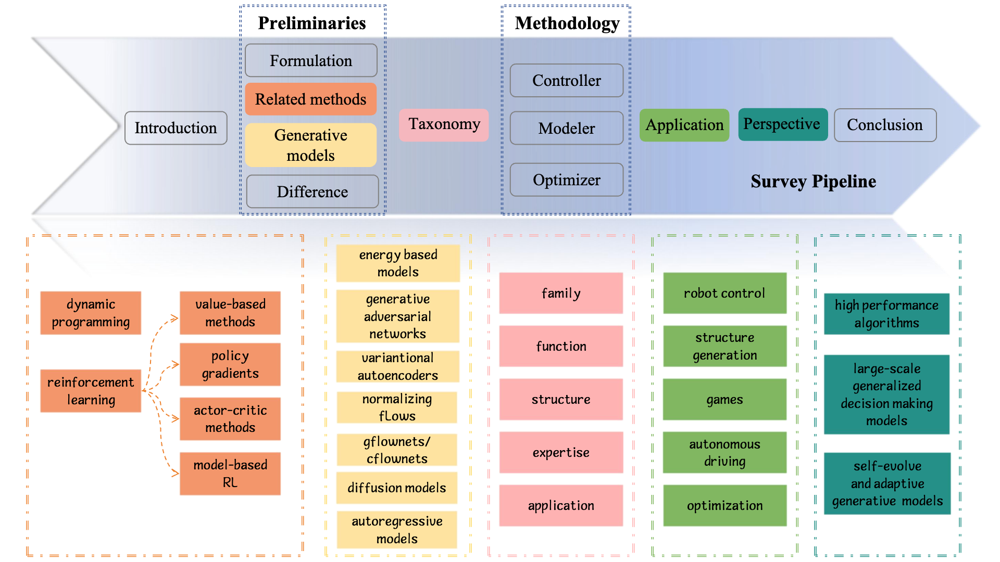
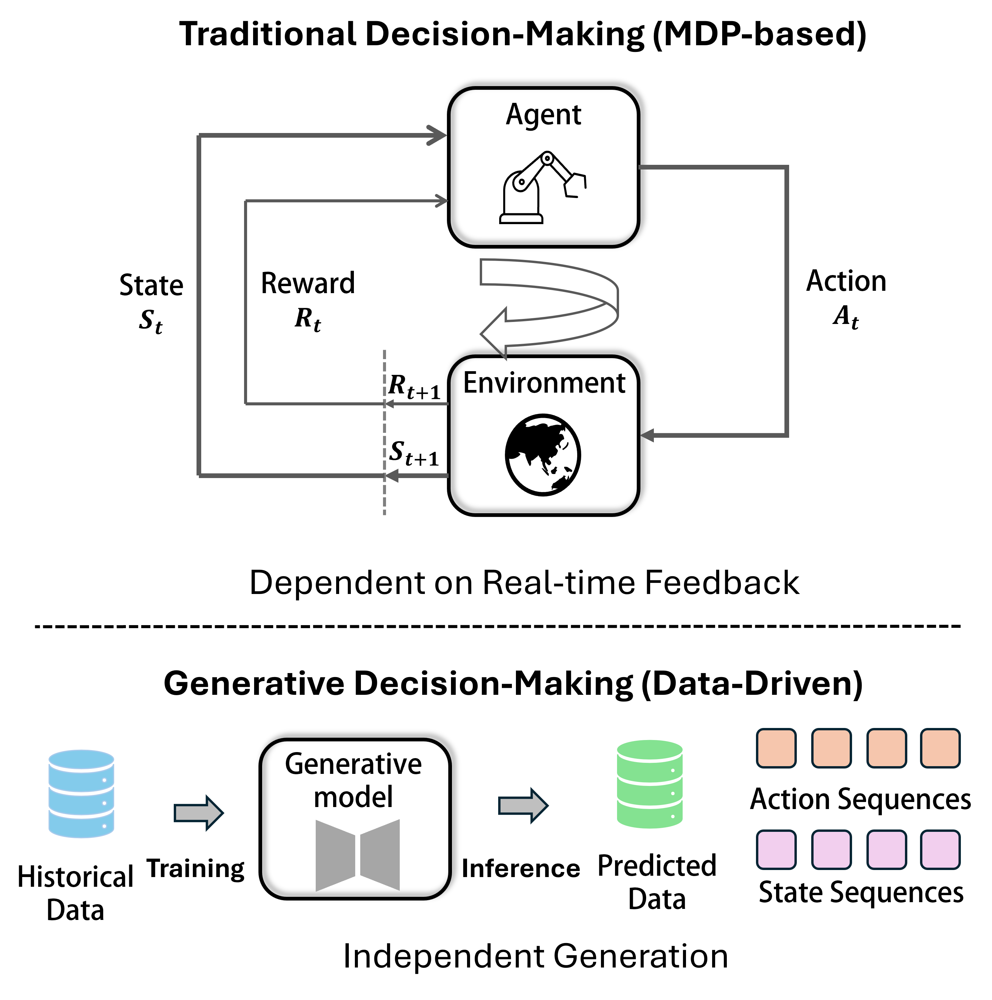
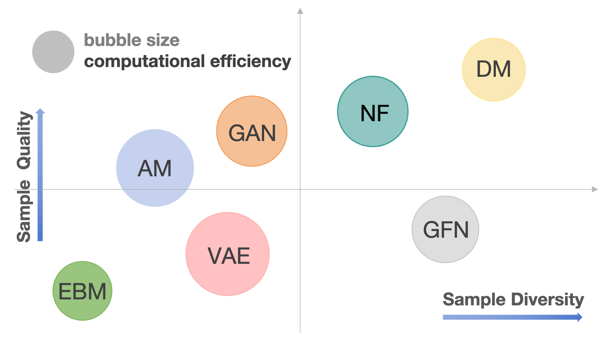
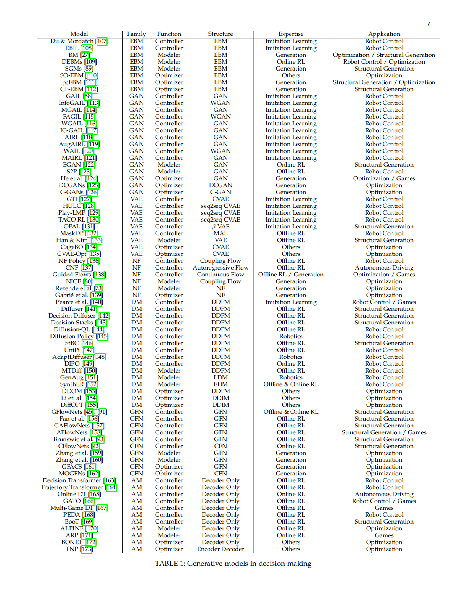
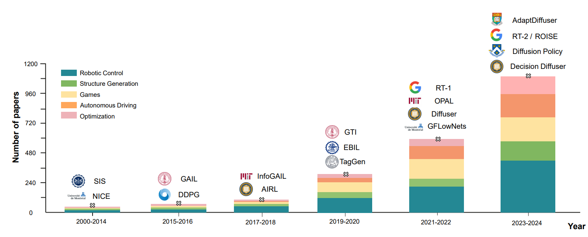

**论文链接**：[Generative Models in Decision Making: A Survey](https://arxiv.org/abs/2502.17100)

**主页链接**：https://github.com/xyshao23/Awesome-Generative-Models-for-Decision-Making-Taxonomy

近年来，生成模型在内容生成（AIGC）领域蓬勃发展，同时也逐渐引起了在**智能决策**中的应用关注。由于生成模型能够处理复杂的数据分布，并具备强大的建模能力，它们可以被引入**决策系统**，用于生成引导代理进入高奖励状态的轨迹或中间子目标。本综述系统性地梳理了**生成模型在决策任务中的应用**，并提供了全面的分类框架。

---

## 1. 研究背景与动机

在智能决策中，传统的方法（如强化学习、动态规划与优化）通常依赖**手工设计的策略**或**基于试错的优化方式**。然而，这些方法往往存在计算开销大、探索受限、泛化能力不足等问题。

相比之下，**生成模型**能够通过学习环境中的数据分布，生成更具多样性的策略，并在复杂环境中探索更优解。这一能力使得生成模型成为决策优化的重要工具。

### 主要挑战：
- **如何在环境交互中学习策略，而不仅仅模仿专家行为？**
- **如何从已有行为中生成新策略，实现策略泛化？**
- **如何构建鲁棒的决策生成模型，以适应多种环境？**
- **如何实现决策过程的多步推理与长期优化能力？**

---

## 2. 生成模型的分类与决策应用

### 2.1 生成模型的基本类型
本综述归纳了七种主要的生成模型：

| **生成模型** | **主要特点** |
|------------|----------------|
| **基于能量的模型（EBM）** | 通过能量函数建模数据分布，适用于高维复杂数据 |
| **生成对抗网络（GAN）** | 采用对抗训练生成高质量数据，但训练稳定性较差 |
| **变分自编码器（VAE）** | 通过概率模型学习潜在空间，生成稳定但质量有限 |
| **归一化流（NF）** | 采用可逆变换，实现高效的密度估计和生成 |
| **扩散模型（DM）** | 通过噪声扩散与去噪过程生成高质量样本 |
| **生成流网络（GFlowNet）** | 通过流匹配策略生成多样化的决策路径 |
| **自回归模型（AM）** | 逐步生成序列数据，常用于文本和动作预测 |

生成式模型旨在基于现有数据集的潜在分布生成未见过的数据样本。在决策中，生成式模型的表现通常由三个关键维度来衡量：**样本质量、多样性和计算效率**。这些维度直接影响生成结果的准确性、稳健性和适用性，因此对于评估生成式模型在决策中的表现至关重要。

在这三个维度之间取得平衡，成为了生成式模型的一大挑战。例如，扩散模型（Diffusion Models）和归一化流（Normalizing Flows）能够提供强大的样本多样性和稳定性，但其计算资源需求较高，限制了其**在实时决策应用中的适用性**。相比之下，像变分自编码器（VAEs）和生成对抗网络（GANs）则在训练速度和计算效率上更具优势，但在保持样本多样性方面可能存在困难，导致生成的输出可能过于相似或出现过拟合现象。

通过对现有研究的综合比较，我们可以大致了解这七种生成式模型在样本质量、多样性和效率上的表现差异，从而为选择合适的生成模型提供参考。这些比较帮助我们更好地理解生成式模型的优缺点，特别是在实际决策过程中如何平衡各项需求。

### 2.2 生成模型在决策中的角色
文章3、4两节深入探讨了生成式模型在决策中的三大核心功能，并基于我们提出的方法论分类体系对现有文献进行了归纳整理。

| **角色** | **作用** |
|------------|----------------|
| **控制器（Controller）** | 直接生成策略或动作序列 |
| **建模器（Modeler）** | 通过环境建模辅助决策 |
| **优化器（Optimizer）** | 通过优化策略提升决策质量 |

若读者希望深入了解相关文献的具体分类及其在决策中的应用，我们的论文提供了系统性的梳理与深入解析，欢迎垂阅。

---

## 3. 生成模型在现实世界的应用
生成模型在多个现实决策领域中展现出强大能力，包括**机器人控制、结构生成与优化、游戏 AI、自动驾驶和优化问题**。以下是这些领域中的一些典型应用。

### 3.1 机器人控制
机器人控制指的是指挥机器人执行特定任务或动作的过程。通过手动控制、预编程指令或利用传感器和机器学习算法实现自主决策等方式，都可以实现机器人控制。生成式模型在机器人控制中扮演着重要角色，不仅可以直接控制机器人，还能通过生成合成数据来增强控制策略的训练效果。例如，生成模型在轨迹生成和运动控制等方面得到了广泛应用。

### 3.2 结构生成与优化
生成式模型在图结构任务中的应用也越来越广泛，如图生成、图补全和图分类等。这些模型能够学习训练图的结构，并生成具有相似特征的新图，广泛应用于分子设计、蛋白质相互作用建模和建筑优化等领域。例如，生成流网络（GFlowNets）在药物发现中被应用，通过生成多样化的候选解决方案来优化决策过程。同时，强化学习与自然语言处理结合的最新研究成果，也进一步推动了结构生成在决策中的应用。

### 3.3 游戏与强化学习
游戏AI是研究的一个重要领域，旨在开发能够在人类水平上执行各种游戏任务的AI系统。生成式模型在**单人游戏和多人游戏**中都展现了其巨大潜力。比如，基于变换器的多游戏决策转换器（Multi-Game Decision Transformer）能够高效处理多种游戏场景，而生成代理（Generative Agents）则能够模拟人类行为，使得多人游戏的复杂度和深度得以提升。

### 3.4 自动驾驶
生成式模型在自动驾驶领域的应用主要体现在驾驶控制、物体检测和场景理解等方面。在驾驶决策中，生成式模型通过生成复杂的决策政策，帮助自动驾驶系统做出快速响应。同时，这些模型还能够通过生成合成数据来解决训练数据匮乏的问题，尤其是在边缘案例中，帮助系统适应更复杂的道路场景。

### 3.5 优化问题
生成式模型在多种优化任务中也展现出了强大的能力，尤其是在黑箱优化、神经网络架构搜索（NAS）和调度优化等方面。通过学习组合问题的解分布，生成式模型能够优化组合问题的求解过程。在神经架构搜索中，生成式模型优化神经网络设计，以提高网络性能。此外，在调度优化中，生成模型帮助平衡方案的多样性和质量，提升求解效率。

---

## 4. 未来发展方向

尽管生成模型在决策任务中展现了巨大潜力，但仍然存在一些挑战。本综述提出了**三个关键发展方向**：

1. **高效算法**：
高效算法是推动生成模型在智能决策中落地应用的关键方向。当前，优化计算效率已成为研究重点，例如减少扩散模型的采样时间，以提升生成速度，同时针对自回归方法，改进其推理效率，以满足实时决策的需求。通过更高效的算法设计，生成模型在复杂决策任务中的应用将更加广泛，进一步提升智能系统的响应速度与实用性。

2. **大规模泛化能力**：
大规模泛化能力决定了生成模型在不同任务和环境中的适配性。未来研究需要深入探索如何提升生成模型的跨任务泛化能力，使其能够在多种环境中保持稳定的决策性能。结合多模态学习，模型可以利用多源信息进行更深层次的环境理解，从而在复杂、不确定的环境中展现更强的适应能力。这种泛化能力的提升将极大拓宽生成模型的应用边界，推动通用智能的进一步发展。

3. **自进化与自适应模型**：
自进化与自适应模型是让生成式决策系统具备长期优化能力的关键。通过发展能够自我调整和优化的生成模型，使其能够在不同决策环境中自动适应变化，从而提高决策的灵活性和稳健性。此外，结合强化学习，模型可以在不断交互中优化自身策略，实现长期的自适应调整，逐步趋近最优决策。这一方向的突破将推动智能体向更高级别的自主学习和自我优化迈进，为更复杂的智能决策任务提供支持。

---

## 5. 总结

生成式 AI 正在重塑智能决策的未来！ 本综述系统性地归纳了**七种生成模型**，构建了一个**全新的决策智能分类框架**，涵盖**控制器、建模器、优化器**三大核心角色。我们深入剖析了生成模型在**机器人控制、自动驾驶、游戏 AI、优化任务**等关键领域的变革性应用，并前瞻性地探讨了未来研究方向。

从智能体的自主学习到复杂决策的优化，生成式 AI 正成为人工智能发展的新引擎！随着技术的加速演进，我们正站在智能决策新时代的起点，迎接一个**更加高效、自适应、泛化能力更强**的 AI 时代。

未来已来，你准备好了吗？

## 标题
华为诺亚 & 清华 & UCL 联合发布：生成式决策的未来已来！
华为诺亚 & 清华 & UCL 联合发布：生成式AI如何重塑智能决策？
清华 & UCL & 华为诺亚万字综述：生成式AI如何助力机器人、自动驾驶与智能优化？

## 作者简介
待补充
建议给到**150字以内**的作者介绍，我们会在正文中展示。

